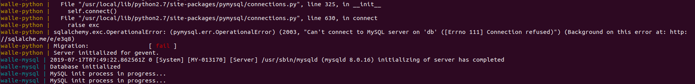

# docker 中部署  walle

[TOC]

# 参考资料

[Docker安装](http://www.walle-web.io/docs/installation_docker.html) - 官方文档

# 部署

## walle.env

vi walle.env

```
# Set MySQL/Rails environment
MYSQL_USER=root
MYSQL_PASSWORD=walle
MYSQL_DATABASE=walle
MYSQL_ROOT_PASSWORD=walle
MYSQL_HOST=db
MYSQL_PORT=3306
```

## docker-compose.yml

在官方的基础上做了一些调整，挂载全部使用卷；但是，目前还是会创建几个没有识别到的卷；需要后续优化

```yml
# docker version:  18.06.0+
# docker-compose version: 1.23.2+
# OpenSSL version: OpenSSL 1.1.0h
version: "3.7"
services:
  web:
    image: alenx/walle-web:2.1
    container_name: walle-nginx
    hostname: nginx-web
    ports:
      # 如果宿主机80端口被占用，可自行修改为其他port(>=1024)
      # 0.0.0.0:要绑定的宿主机端口:docker容器内端口80
      - "40007:80"
    depends_on:
      - python
    networks:
      - walle-net
    restart: always

  python:
    image: alenx/walle-python:2.1
    container_name: walle-python
    hostname: walle-python
    env_file:
      # walle.env需和docker-compose在同级目录
      - ./walle.env
    command: bash -c "cd /opt/walle_home/ && /bin/bash admin.sh migration &&  python waller.py"
    expose:
      - "5000"
    volumes:
      - walle-plugins:/opt/walle_home/plugins/
      - walle-codebase:/opt/walle_home/codebase/
      - walle-logs:/opt/walle_home/logs/
    depends_on:
      - db
    networks:
      - walle-net
    restart: always

  db:
    image: mysql
    container_name: walle-mysql
    hostname: walle-mysql
    env_file:
      - ./walle.env
    command: [ '--default-authentication-plugin=mysql_native_password', '--character-set-server=utf8mb4', '--collation-server=utf8mb4_unicode_ci']
    expose:
      - "3306"
    volumes:
      - walle-mysql/var/lib/mysql
      - /usr/share/zoneinfo/:/usr/share/zoneinfo/:ro
    networks:
      - walle-net
    restart: always

networks:
  walle-net:
    driver: bridge
volumes:
  walle-plugins:
  walle-codebase:
  walle-logs:
  walle-mysql:
```

## Error

如果遇见一下错误，请 docker-compose stop 之后再docker-compose up 一次就可以了，这是mysql没有初始化完，就启动了python-server



# 开始使用

## 初始账号

```
超管：super@walle-web.io \ Walle123
所有者：owner@walle-web.io \ Walle123
负责人：master@walle-web.io \ Walle123
开发者：developer@walle-web.io \ Walle123
访客：reporter@walle-web.io \ Walle123
```