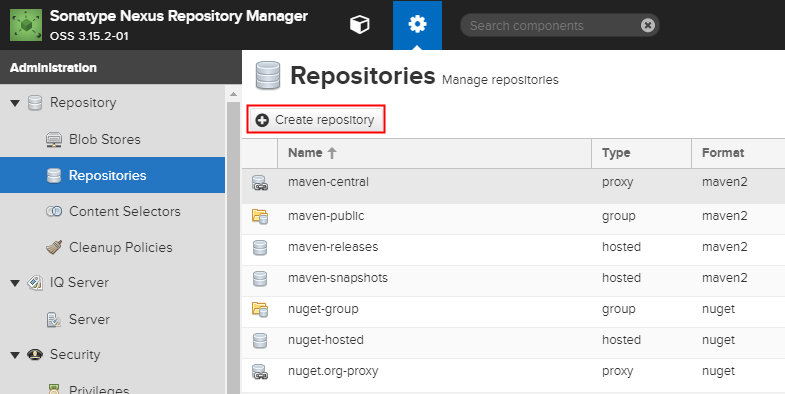
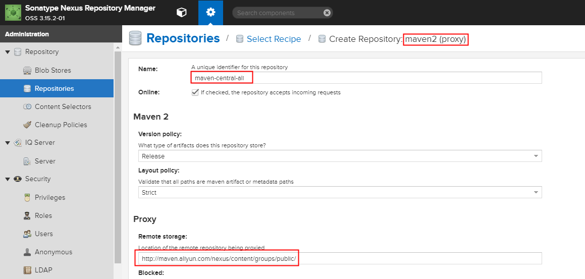
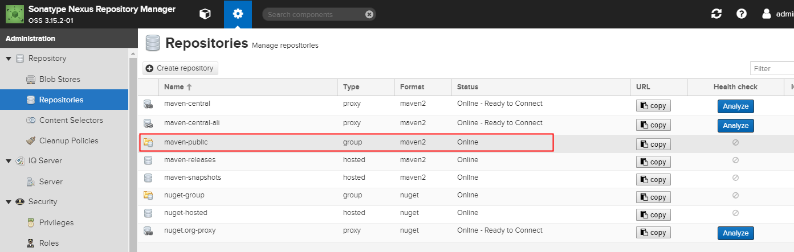
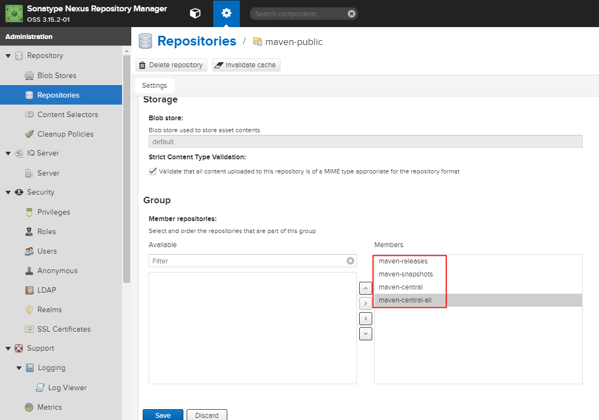
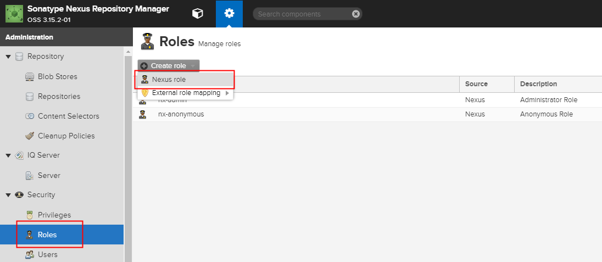
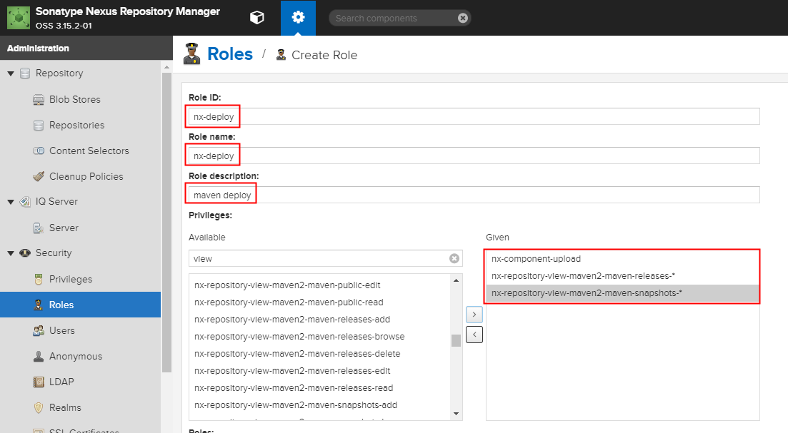
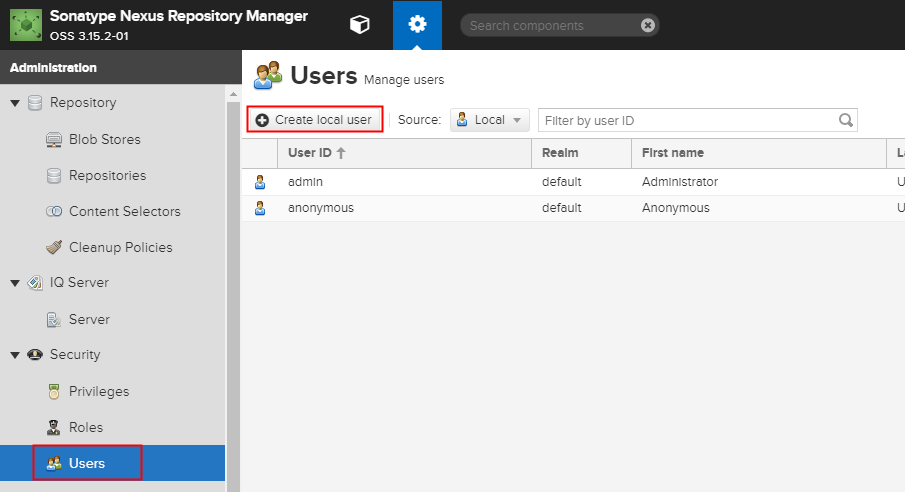
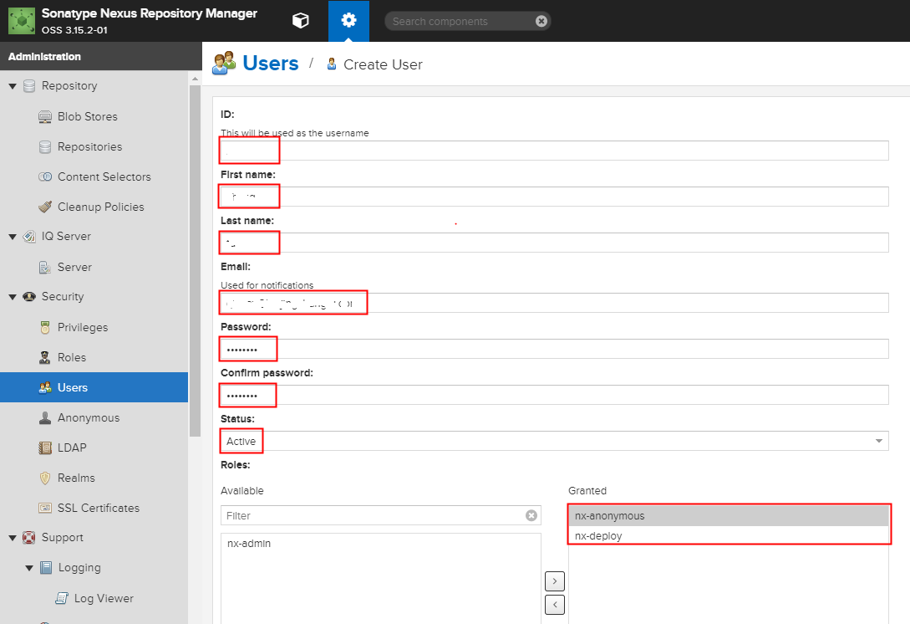

# Centos7 部署 nexus 3.15.x 与配置

[TOC]

# 参考资料

《maven实战》
[Repository Manager 3](https://help.sonatype.com/repomanager3/) - 英文 - 官方文档

# 安装

## 下载 nesux

确保本机有 wget，如果没有执行 `yum install -y wget`

下载 nesux 最新 tar.gz 包，并解压到目录

```sh
cd /opt/installer
# 下载地址到 nesux 官网：https://help.sonatype.com/repomanager3/download
wget http://download.sonatype.com/nexus/3/nexus-3.15.2-01-unix.tar.gz
tar xzf nexus-3.15.2-01-unix.tar.gz -C /opt/
```

## 创建用户并赋予权限

```sh
adduser nexus
chown -R nexus nexus-3.15.2-01/
chown -R nexus sonatype-work/
```

## 设置开机启动

创建配置文件：`vi /etc/systemd/system/nexus.service`

如容如下：

```sh
[Unit]
Description=nexus service
After=network.target

[Service]
Type=forking
LimitNOFILE=65536
ExecStart=/opt/nexus-3.15.2-01/bin/nexus start
ExecStop=/opt/nexus-3.15.2-01/bin/nexus stop
User=nexus
Restart=on-abort

[Install]
WantedBy=multi-user.target
```

```sh
# 重新载入配置
systemctl daemon-reload

# 设计开机启动，并启动
systemctl enable nexus.service
systemctl start nexus.service

# 防火墙开放端口
firewall-cmd --permanent --add-port=8081/tcp
systemctl restart firewalld
```

# 配置 nexus

默认的管理员
账号：admin
密码：admin123

## 仓库配置

nexus 默认的镜像仓库访问的是：https://repo1.maven.org/maven2/

由于中央仓库经常会出现下载慢的问题，所以我们会在配置一个国内阿里的镜像库，在中央仓库下载慢的时候，会使用阿里的镜像库。

### 添加一个阿里云的镜像仓库



创建一个 maven2 proxy；配置阿里的镜像库 

类型： maven2(proxy)
名称:： maven-central-ali
仓库地址： http://maven.aliyun.com/nexus/content/groups/public/



### 配置 maven-public

添加新增的 阿里镜像库到 public 中





## 用户权限配置

由于总管理员 admin 不能支撑 maven deploy。因此，专门创建一个用户用于 maven deploy。

### 添加角色



+ `Role ID` / `Role name`: nx-deploy
+ `Role description`: maven deploy
+ `Privileges`: 
  + nx-component-upload // 允许手动上传 jar 到仓库中
  + nx-repository-view-maven2-maven-releases-* // 允许通过 maven deploy 发布**稳定构建** jar 到 release 仓库中
  + nx-repository-view-maven2-maven-snapshots-* // 允许通过 maven deploy 发布**不稳定构建** jar 到 snapshots 仓库中



### 添加用户





# 在 pom.xml 中使用

  <repositories>
    <repository>
      <id>zt</id>
      <name>Mine Repository</name>
      <url>http://172.17.0.6:8081/repository/maven-public/</url>
      <releases><enabled>true</enabled></releases>
      <snapshots><enabled>true</enabled></snapshots>
      <layout>default</layout>
    </repository>
  </repositories>